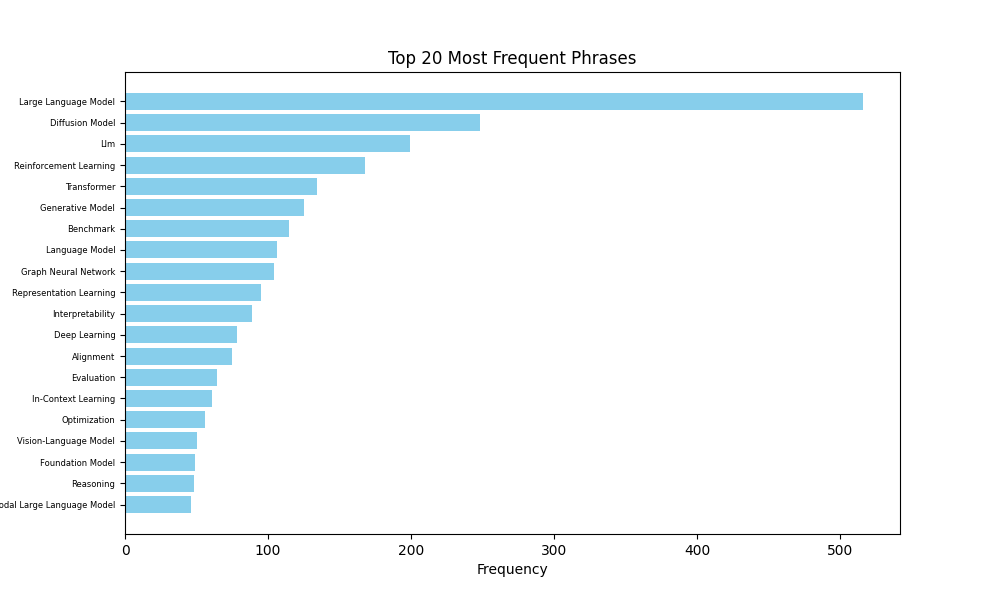

# An OpenReview Crawler
crawl, select and visualize submissions from a conference on OpenReview


### Overview
Top 20 most frequent phrases in keywords of ICLR 2025 submissions


### Usage
##### 1. Read submissions from OpenReview
1. create a database and a table in MySQL, you can run the script in your mysql if your target is ICLR 2025
```sql
source create_db.sql
```
2. run the reptile script to gather information from OpenReview
```bash
python gather_info_iclr_2025.py
```
3. Select submissions based on ratings and/or your interests
